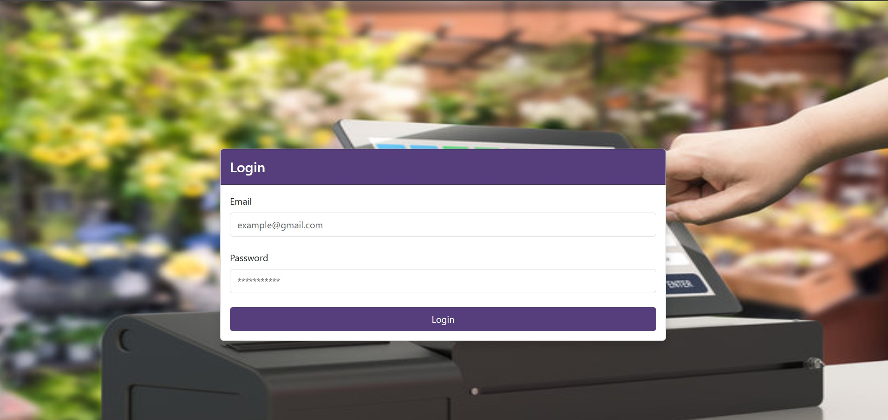
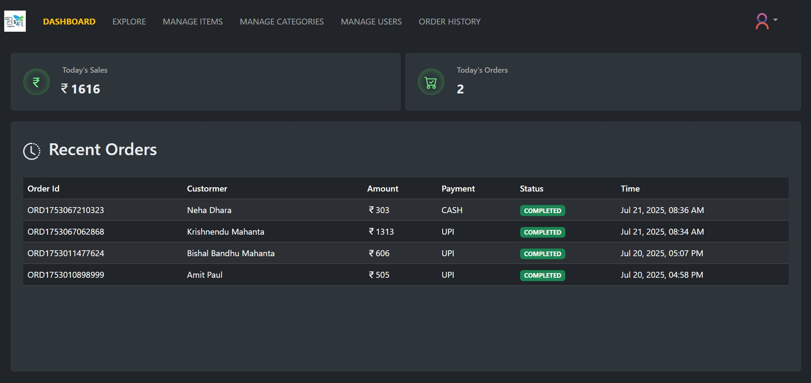
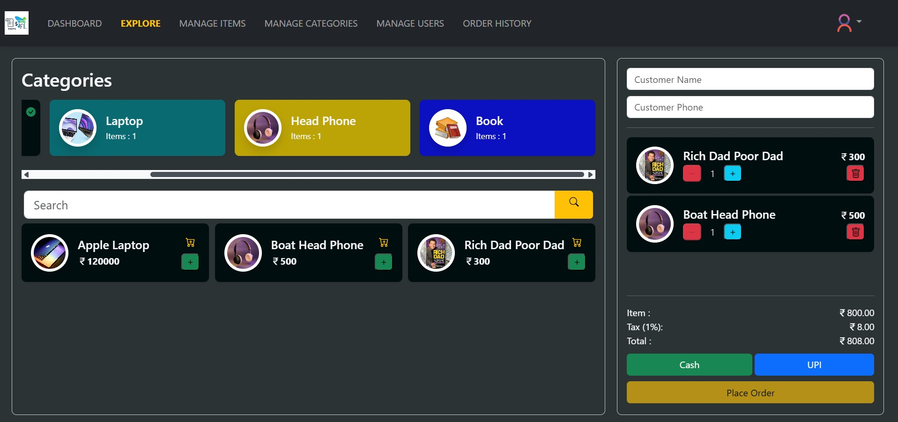
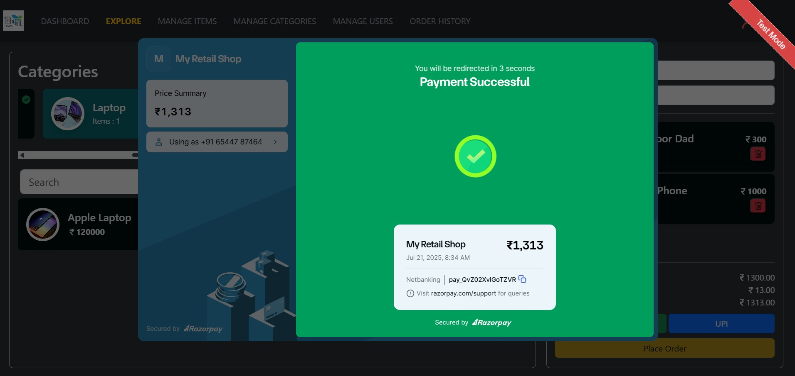
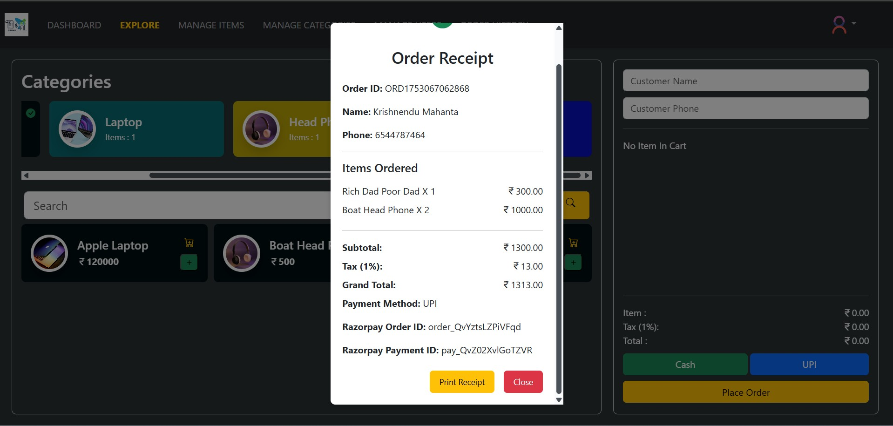
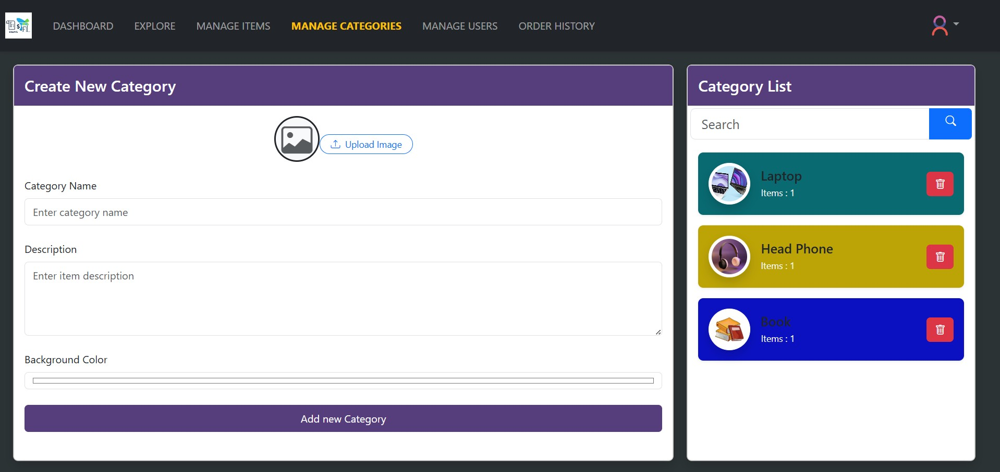
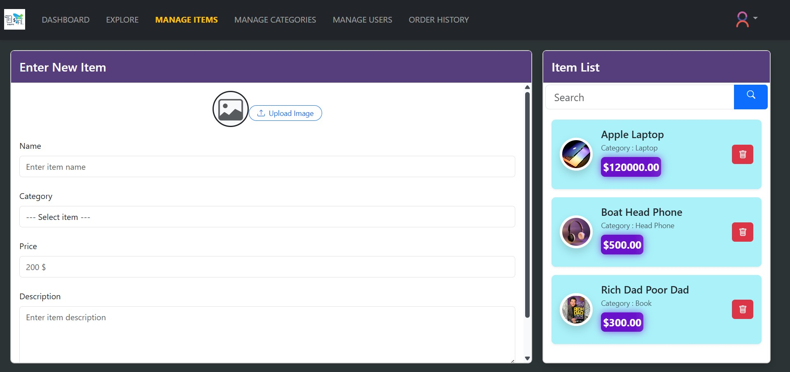
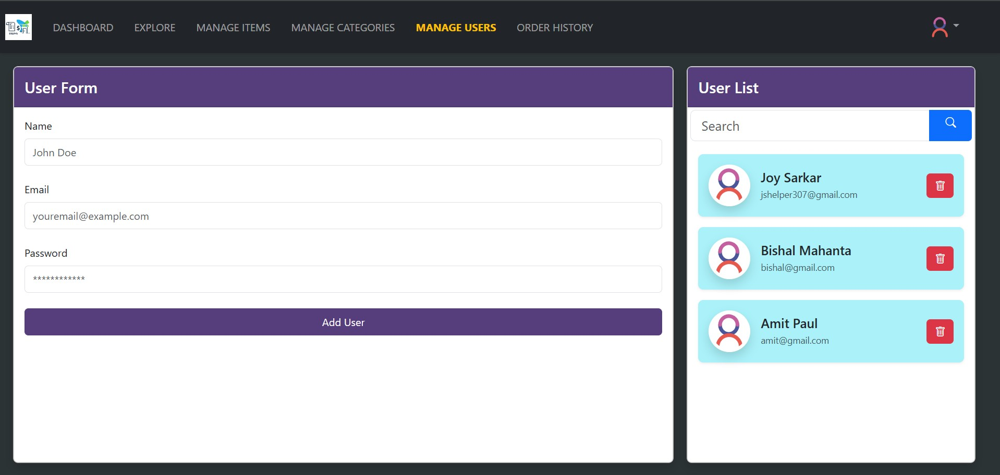
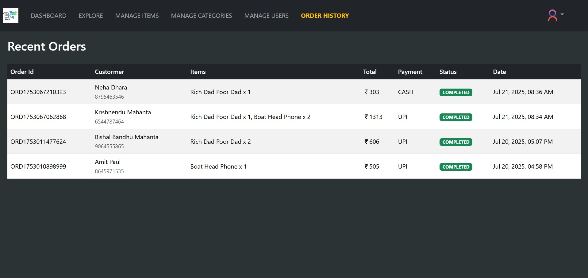
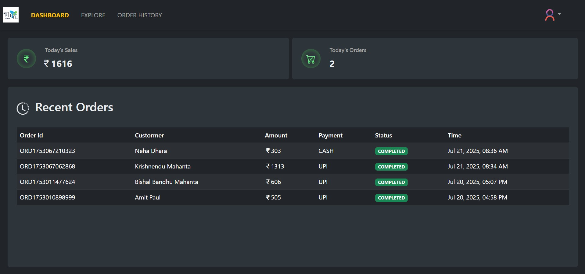

# 🧾 Retail Shop Billing System

A modern full-stack **Billing Website for Retail Shops** that allows shop owners to manage users, product categories, items, and customer orders. It supports multiple payment modes (Cash & UPI via Razorpay), generates receipts, and provides dashboard insights for both admin and users.

---

## 🚀 Features

### 👨‍💼 Admin Panel
- Manage Users (Create, Delete)
- Manage Product Categories (Add, Delete)
- Manage Items (Add, Delete)
- View Today's Sales and Recent Orders

### 👥 User Panel
- Add products to cart (Customer-wise)
- Place order with receipt
- View own sales and recent orders

### 💳 Payments
- Cash Payment
- UPI Integration using Razorpay

### 📊 Dashboard Insights
- Today’s Sales Overview
- Recent Orders List
- Role-based Access Control

---

## 🛠️ Tech Stack

- **Frontend:** React.js / CSS / Bootstrap
- **Backend:** Java / Spring Boot
- **Database:** MySQL
- **Payment Gateway:** Razorpay
- **Authentication:** JWT / Role-based access

---

## 📸 Screenshots

### 🔐 Login Page


### 📊 Admin Dashboard


### 🛒 Add Items to Cart Add Place order for generate receipt


### 🧾 UPI payment Page


### 🧾 Receipt Page


### 🍔 Manage Category Page


### 🧸 Manage Items Page


### 👨‍🦰 Manage Users Page


### 🕔 Order History Page


### 📊 Normal User Dashboard


---

## ⚙️ Installation

1. **Clone the repository**

```bash
git clone https://github.com/JoySarkar07/BillingWebsite.git
cd BillingWebsite
